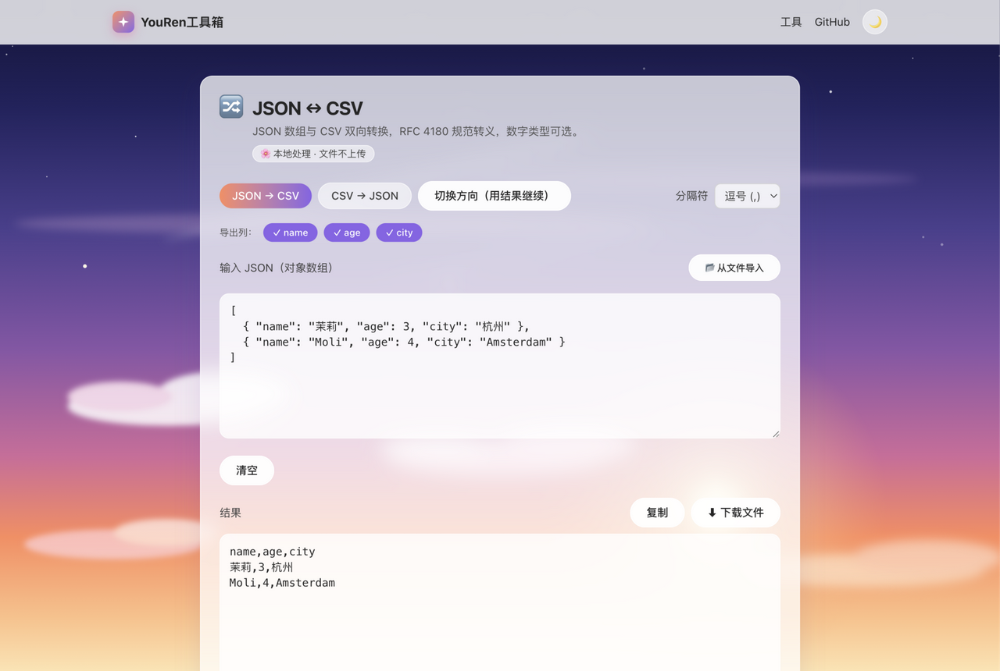

# YouRen Toolbox (youren-tools)

[中文说明](./README.md)

[](https://github.com/YouRen1320/youren-tools/actions/workflows/ci.yml)
[](https://github.com/YouRen1320/youren-tools/actions/workflows/ci.yml)
[](./LICENSE)


<p align="center">
  
  
</p>

A small, fast Chinese-first online toolbox. **Everything runs locally in your browser — no file ever leaves your device**, and it works offline once installed.

## Live

**https://youren1320.github.io/youren-tools/**

## Implemented (v1.14.0)

| Category | Tool                | Description                                                         |
| -------- | ------------------- | ------------------------------------------------------------------- |
| PDF      | PDF Merge           | Merge multiple PDFs in order, reorderable                           |
| PDF      | PDF Extract Pages   | Export selected pages (e.g. `1,3-5`) to a new file                  |
| PDF      | PDF to Image        | Render pages to PNG/JPG (adjustable quality), multi-page zip        |
| PDF      | PDF Watermark       | Tiled image or diagonal text watermark on every page                |
| Image    | Image Compress      | Re-encode to WebP/JPEG/PNG with quality control                     |
| Text     | Base64              | UTF-8 safe encode/decode, emoji-friendly                            |
| Text     | JSON Formatter      | Format / minify / validate with error positions                     |
| Text     | Word Counter        | CJK-aware word/character/line/paragraph stats, live                 |
| Text     | URL Codec           | Percent-encoding for URL components and full URLs                   |
| Text     | Markdown Preview    | Live preview with XSS-sanitized HTML output                         |
| Text     | Text Diff           | Line-level diff with add/remove highlighting                        |
| Text     | Text Cleaner        | Dedupe / sort / drop empty lines / trim, live                       |
| Time     | Timestamp Converter | Unix seconds/milliseconds ↔ datetime                                |
| Generate | QR Code Generator   | Text or URL → PNG, adjustable size & ECC                            |
| Design   | Color Converter     | HEX/RGB/HSL conversion with live preview                            |
| Design   | Contrast Checker    | WCAG ratio with AA/AAA verdicts                                     |
| Convert  | Unit Converter      | Length/weight/temperature incl. Chinese units (里/斤/两)            |
| Convert  | JSON ↔ CSV          | RFC 4180 round-trip-safe conversion, comma/semicolon/Tab delimiters |
| Dev      | Hash Calculator     | SHA-1/256/384/512 for text & files (WebCrypto)                      |
| Dev      | Password Generator  | Crypto-grade randomness with entropy rating                         |
| Dev      | UUID Generator      | Batch v4 UUID generation, one-click copy                            |

Also included: tool registry (zero route changes to add a tool), service & component tests (126 cases), ESLint + Prettier, type checking, GitHub Actions CI (SHA-pinned actions), Dependabot, PWA (installable & offline), day/night themes, OG share card, automatic deployment to GitHub Pages, sitemap + robots.txt, WCAG AA readability.

## Not implemented (roadmap)

- Custom domain binding; PDF compression (needs a qpdf-wasm-grade solution — pdf-lib's useObjectStreams measured 0.0% reduction on both image-heavy and text PDFs)
- Douyin / Xiaohongshu tools (needs a small backend; compliance under review)
- Audio & video processing (ffmpeg.wasm), multi-language UI

## Quick start

Requires Node.js ≥ 22 and pnpm ≥ 11.

```bash
git clone https://github.com/YouRen1320/youren-tools.git
cd youren-tools
pnpm install
pnpm dev        # http://localhost:4321/youren-tools/
```

Other commands: `pnpm test` / `pnpm lint` / `pnpm typecheck` / `pnpm build` / `pnpm preview`.

Deployment is automatic: pushing to `main` builds and publishes via GitHub Actions.

## Adding a tool

1. Create `src/tools/<category>/<tool>/` with `meta.ts` (registration), `service.ts` (pure logic, unit-tested) and `index.tsx` (component, default export).
2. Import and append to `allTools` in `src/tools/index.ts` — routes and the home grid update automatically.
3. Add tests; the registry integrity test validates slug uniqueness and metadata.

## Tech stack

Astro (static output) + React (islands) + Tailwind CSS + pdf-lib + pdf.js + qrcode + TypeScript / Vitest / ESLint. The sky illustration is original SVG artwork inspired by Makoto Shinkai's aesthetic — no third-party copyrighted assets.

## Disclaimer

All tools run locally in your browser; nothing is collected or uploaded. Use only with files you are legally entitled to process.

## License

[MIT](./LICENSE) © 2026 YouRen (YouRen1320)
