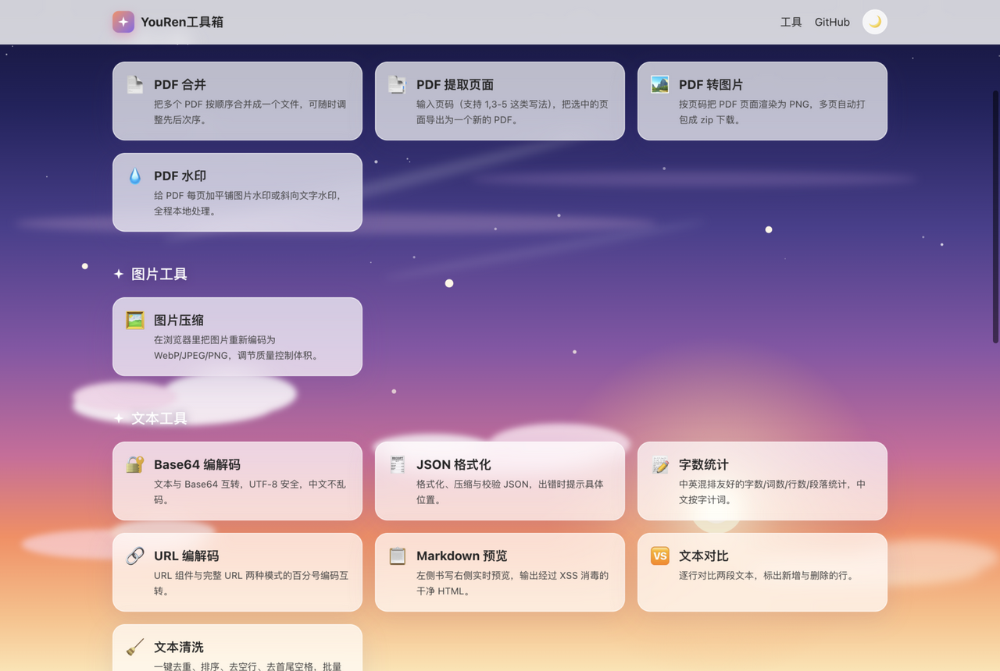

# YouRen工具箱（youren-tools）

[](https://github.com/YouRen1320/youren-tools/actions/workflows/ci.yml)
[](./LICENSE)
[](https://youren1320.github.io/youren-tools/)

[English](./README.en.md)

小而快的中文在线工具箱。**所有处理都在你自己的浏览器里完成，文件不上传服务器** —— 断网也能用。

## 已实现 / 未实现

### ✅ 已实现（v1.9.0）

| 分类 | 工具          | 说明                                                     |
| ---- | ------------- | -------------------------------------------------------- |
| PDF  | PDF 合并      | 多个 PDF 按顺序合并，支持调整次序                        |
| PDF  | PDF 提取页面  | 按 `1,3-5` 写法提取页面导出为新文件                      |
| PDF  | PDF 转图片    | 按页码渲染为 PNG/JPG（质量可调），多页自动打包 zip 下载  |
| PDF  | PDF 水印      | 平铺图片水印或斜向文字水印，每页自动覆盖                 |
| 图片 | 图片压缩      | 重编码为 WebP/JPEG/PNG，质量可调，显示节省比例           |
| 文本 | Base64 编解码 | UTF-8 安全，中文与 emoji 不乱码                          |
| 文本 | JSON 格式化   | 格式化 / 压缩 / 校验，出错提示位置                       |
| 文本 | 字数统计      | 中英混排友好，中文按字计词，实时更新                     |
| 文本 | URL 编解码    | URL 组件与完整 URL 两种模式的百分号编码互转              |
| 文本 | Markdown 预览 | 实时预览，输出经 XSS 消毒的 HTML，可复制                 |
| 文本 | 文本对比      | 逐行 diff，高亮新增与删除                                |
| 文本 | 文本清洗      | 去重/排序/去空行/去首尾空格，实时批量整理                |
| 时间 | 时间戳转换    | Unix 秒/毫秒与日期时间互转                               |
| 生成 | 二维码生成    | 链接或文本 → PNG，尺寸与容错等级可调                     |
| 设计 | 颜色转换      | HEX/RGB/HSL 互转，实时预览，支持三种格式输入             |
| 设计 | 对比度检查    | WCAG 对比度比值与 AA/AAA 达标判定，实时预览              |
| 换算 | 单位换算      | 长度/重量/温度互转，支持里、尺、寸、斤、两等市制单位     |
| 换算 | JSON ↔ CSV    | RFC 4180 双向转换，逗号/分号/Tab 分隔符可选，往返无损    |
| 开发 | 哈希计算      | 文本/文件的 SHA-1/256/384/512 摘要（WebCrypto 本地计算） |
| 开发 | 密码生成器    | 加密级随机数 + 熵值强度评估，字符集可调                  |
| 开发 | UUID 生成器   | 批量生成 v4 UUID，一键复制                               |

同时已具备：工具注册架构（新增工具零改路由）、服务层与组件测试（110 例）、ESLint + Prettier、类型检查、GitHub Actions CI（安装 → 检查 → 测试 → 构建）、Dependabot 周更、**PWA**（可安装到桌面/手机，Service Worker 本地缓存，离线可用）、**昼夜双主题**（黄昏/星空一键切换，跟随系统偏好）、**GitHub Pages 自动部署**（推送 main 即上线）、sitemap + robots.txt、WCAG AA 级可读性（玻璃面板对比度经工具核查）。




### ❌ 未实现（路线图）

- 自定义域名绑定；PDF 压缩（需 qpdf-wasm 级方案——实测 pdf-lib useObjectStreams 对图片型与文本型 PDF 均无缩减）
- 抖音 / 小红书等平台工具（需要小后端，独立评估合规边界）
- 音频/视频处理（ffmpeg.wasm）、多语言界面

## 快速开始

要求：Node.js ≥ 22、pnpm ≥ 11（`corepack enable` 或 `npm i -g pnpm`）。

```bash
git clone https://github.com/YouRen1320/youren-tools.git
cd youren-tools
pnpm install
pnpm dev        # 开发服务器 http://localhost:4321
```

其他常用命令：

```bash
pnpm test        # 运行全部测试（vitest）
pnpm lint        # ESLint 检查
pnpm format:check
pnpm typecheck   # astro check 类型检查
pnpm build       # 产物输出到 dist/
pnpm preview     # 本地预览构建产物
```

## 目录结构

```
youren-tools/
├── .github/workflows/ci.yml   # CI：安装 → lint → 格式 → 类型 → 测试 → 构建
├── public/                    # 静态资源（favicon 等）
├── src/
│   ├── components/            # 跨工具复用的 React 组件（文件拖放、复制按钮等）
│   ├── layouts/               # Astro 布局（页头/页脚/SEO）
│   ├── lib/                   # 与 UI 无关的纯函数（字节格式化、页码解析、下载）
│   ├── pages/                 # Astro 路由：首页、/tools/[slug]、404
│   ├── styles/                # Tailwind 主题与通用样式
│   └── tools/                 # ★ 工具注册表 + 各工具目录
│       ├── types.ts           #   ToolMeta 类型与 defineTool
│       ├── index.ts           #   汇总注册，校验 slug 唯一
│       └── <分类>/<工具>/      #   meta.ts + index.tsx + service.ts + 测试
└── vitest.config.ts
```

## 如何新增一个工具

1. 在 `src/tools/<分类>/` 下新建目录，写三个文件：
   - `meta.ts`：`defineTool({ slug, category, icon, title, description, keywords, component })`
   - `service.ts`：**纯逻辑**，与 DOM 解耦，便于测试
   - `index.tsx`：界面组件（默认导出），复用 `ToolShell` / `FileDrop` 等组件
2. 在 `src/tools/index.ts` 里 import 并加入 `allTools` —— 页面路由、首页卡片自动生成，无需改任何路由文件。
3. 为 `service.ts` 补上单元测试；跑 `pnpm test` 时注册表完整性测试会自动校验 slug 唯一性与元数据齐全。

## 技术栈

[Astro](https://astro.build)（静态输出）+ [React](https://react.dev)（交互岛屿）+ [Tailwind CSS](https://tailwindcss.com) + [pdf-lib](https://github.com/Hopding/pdf-lib) + [qrcode](https://github.com/soldair/node-qrcode) + TypeScript / Vitest / ESLint。

> 为什么 `package.json` 里直接依赖了 `cookie`：它是 Astro 的传递依赖，但构建产物会在运行期解析它；某些环境下（项目根缺失该依赖时）会向上逃逸出项目目录命中系统里的旧版本，导致构建报 CJS/ESM 兼容错误。显式声明可把解析固定在项目根，请勿移除。

## 环境变量

当前没有任何必需的环境变量。`.env.example` 预留了未来配置；约定：真实密钥只写入 `.env`（已被 git 忽略），示例文件中只放占位符。

## 免责声明

本项目的工具在你的浏览器本地运行，不收集、不上传任何文件。请仅对自己拥有合法权利的文件使用，使用者需遵守所在地区法律法规。

## 许可证

[MIT](./LICENSE) © 2026 YouRen (YouRen1320)
